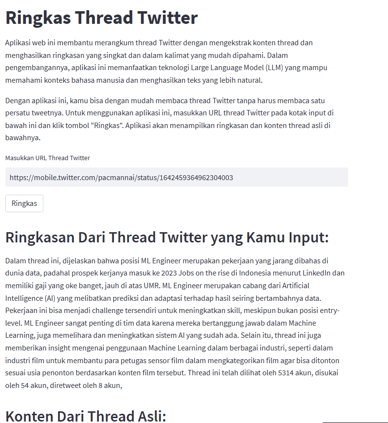

# Ringkas Thread Twitter
Aplikasi web ini membantu merangkum thread Twitter dengan mengekstrak konten thread dan menghasilkan ringkasan yang singkat dan dalam kalimat yang mudah dipahami. Aplikasi ini memanfaatkan teknologi Large Language Model (LLM) yang mampu memahami konteks bahasa manusia dan menghasilkan teks yang lebih natural.

    
    

### Penggunaan
Masukkan URL thread Twitter pada kotak input di bawah ini.
Klik tombol "Ringkas" untuk menampilkan ringkasan dan konten thread asli.

### Cara Kerja
Aplikasi ini terdiri dari dua bagian utama, yaitu scraping dan summarization. Bagian scraping bertugas untuk mengekstrak konten thread Twitter berdasarkan URL yang diinputkan oleh pengguna. Konten thread yang diperoleh meliputi teks pada setiap tweet, jumlah pengguna yang melihat, menyukai, dan retweet tweet, serta jumlah pengguna yang mengutip tweet.

Setelah konten thread didapatkan, bagian summarization akan memproses konten thread tersebut dan menghasilkan ringkasan yang singkat dan mudah dipahami. Proses summarization menggunakan teknologi Large Language Model (LLM) yang terintegrasi dengan library LangChain. LangChain adalah library Python yang memudahkan pemrosesan bahasa natural dengan LLM. Pada aplikasi ini, LangChain digunakan untuk membangun pipeline yang mampu mengekstrak informasi dari konten thread dan menghasilkan ringkasan yang tepat.

### Lisensi
Aplikasi ini dilisensikan di bawah MIT License.
